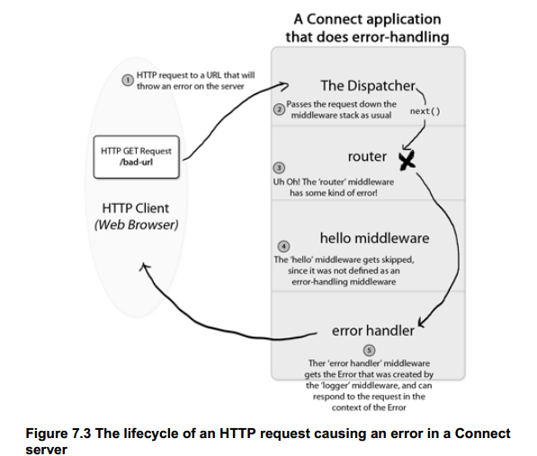

#####errorhandle

refer:`app.handle`; 

<!--  -->

```js
      var arity = layer.handle.length;
      if (err) {
        if (arity === 4) {
          layer.handle(err, req, res, next);
        } else {
          next(err);
        }
      } else if (arity < 4) {
        layer.handle(req, res, next);
      } else {
        next();
      }

```
note:
    Put your speaker notes here.
    You can see them pressing 's'.
